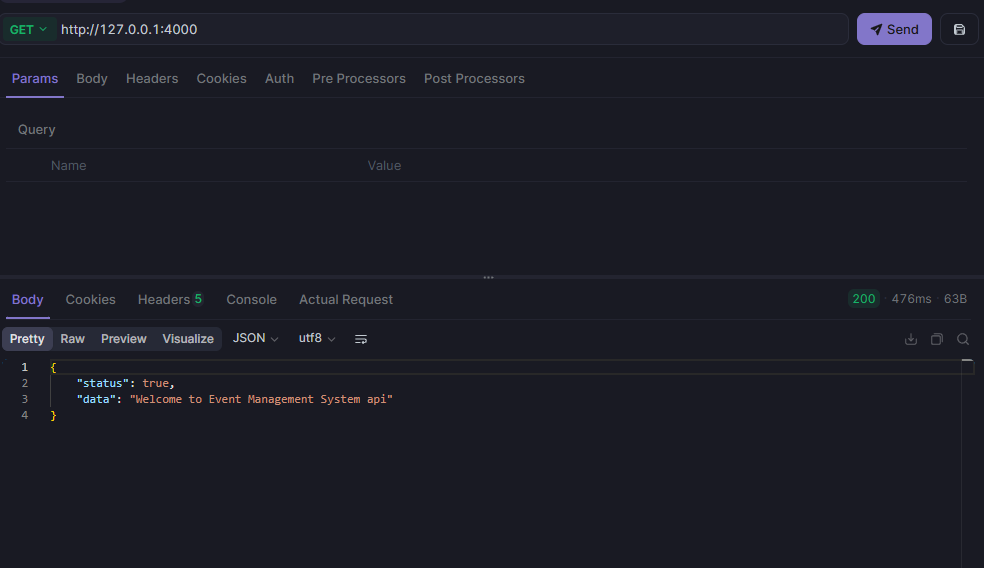
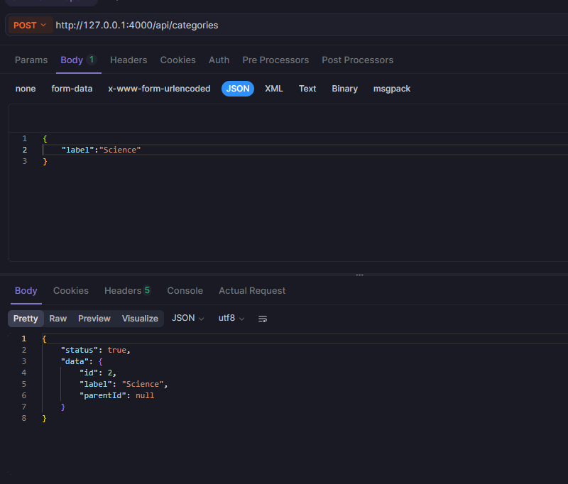
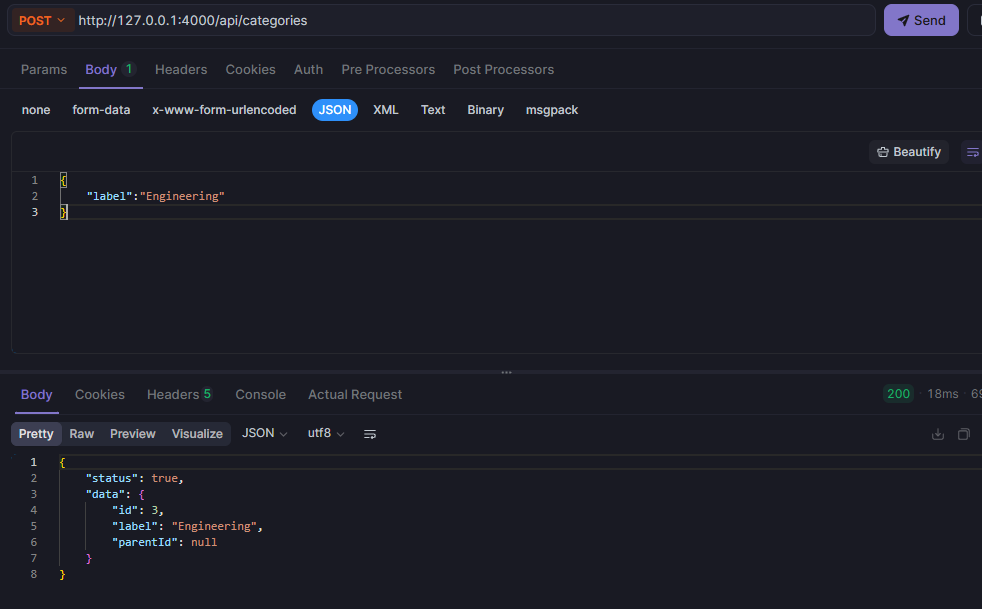
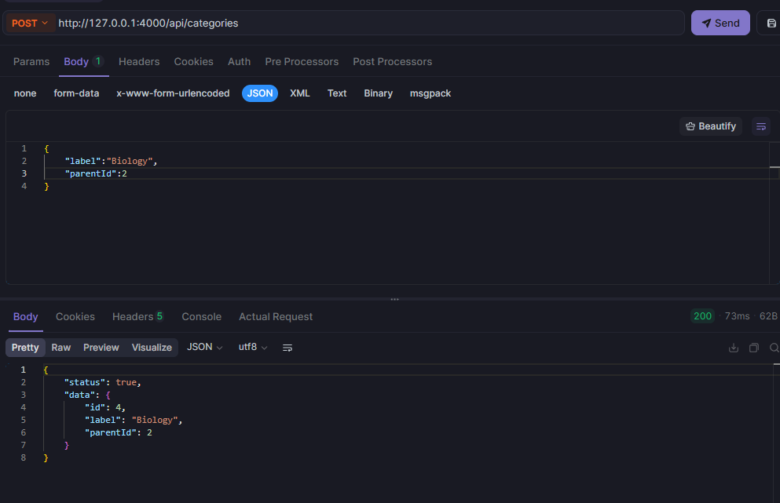
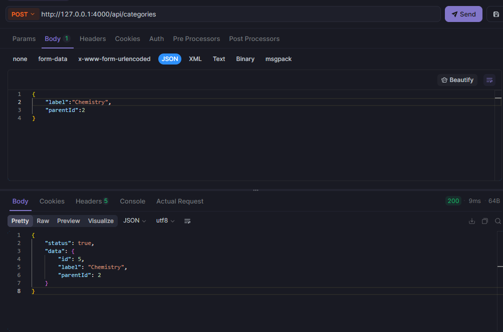
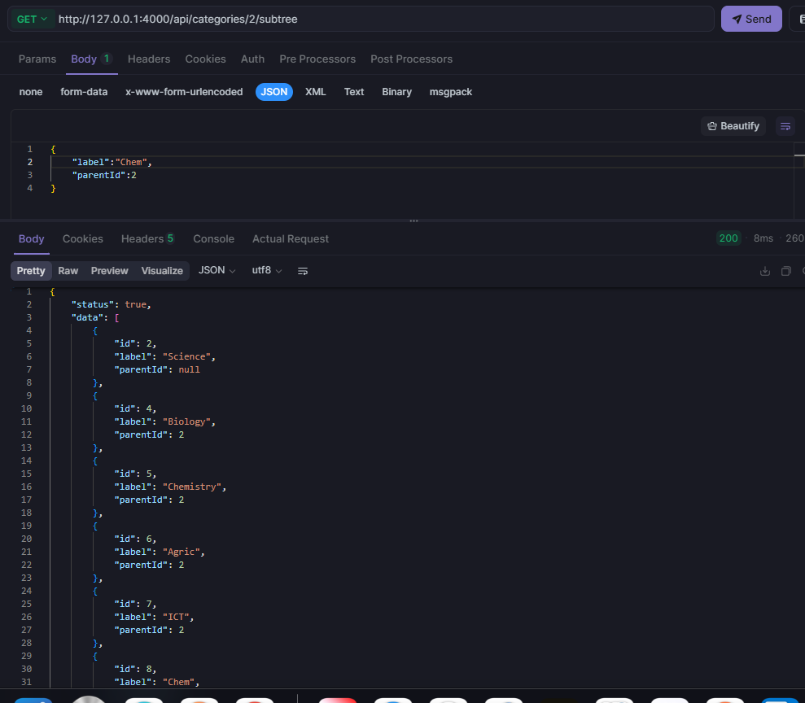
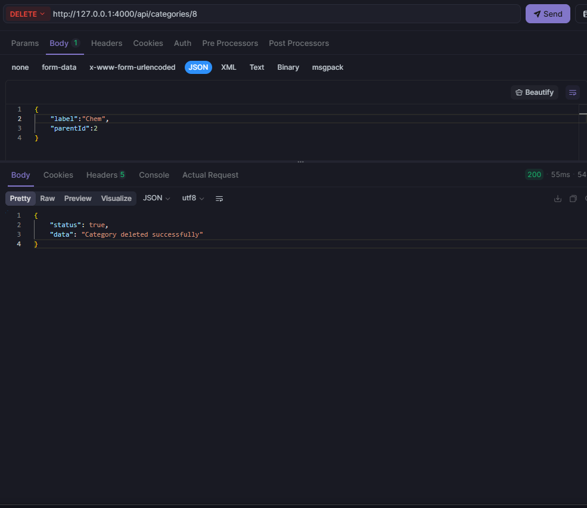
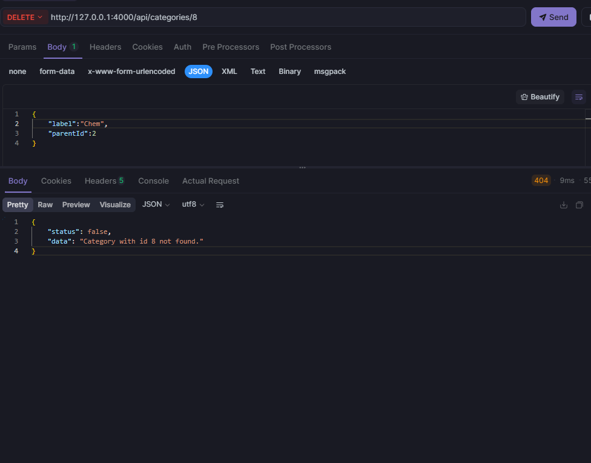
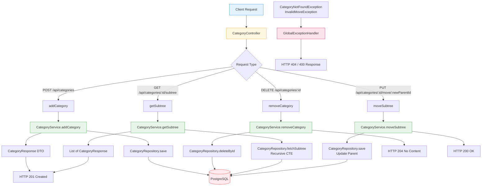

# Category Management System

A production-ready REST API for managing hierarchical categories in an event management application. Built with Spring Boot, Kotlin, and PostgreSQL.

## 📋 Table of Contents

- [Overview](#overview)
- [Architecture](#architecture)
- [Features](#features)
- [Technology Stack](#technology-stack)
- [Project Structure](#project-structure)
- [Setup Instructions](#setup-instructions)
- [API Documentation](#api-documentation)
- [Testing](#testing)
- [Implementation Flow](#implementation-flow)

## 🎯 Overview

This application provides a REST API to manage categories organized as a tree structure with infinite depth. Categories can be added, removed, fetched as subtrees, and moved between parent nodes.

## 🏗️ Architecture

This project follows a **multi-module architecture**:

```
challenge/
├── app/                    # Main application module
│   ├── src/main/kotlin/com/challenge/app/category/
│   │   │
│   │   ├── controller/     # REST endpoints
│   │   │   └── CategoryController.kt 
│   │   │
│   │   ├── service/        # Business logic
│   │   │   └── CategoryService.kt 
│   │   │
│   │   ├── repository/     # Data access layer
│   │   │   └── CategoryRepository.kt 
│   │   │
│   │   ├── dto/            # Data transfer objects
│   │   │   ├── CategoryRequest.kt 
│   │   │   └── CategoryResponse.kt 
│   │   │
│   │   └── model/          # JPA entities
│   │       └── CategoryEntity.kt 
│   │
│   ├── src/main/kotlin/com/challenge/app/
│   │   └── ChallengeApplication.kt  # Main Spring Boot application entry point
│   │   └── HealthController.kt      # For health checks
│   │
│   └── src/test/           # Unit and Integration tests
│
├── deps/            # Shared dependencies/libraries module
│   ├── database/           # PostgreSQL configuration and models
│   │   ├── src/main/kotlin/com/challenge/database/
│   │   │   ├── config/
│   │   │   │   └── PostgresConfiguration.kt 
│   │   │   └── model/
│   │   │       └── PostgresModel.kt 
│   │   └── src/main/resources/
│   │       └── application-database.yml
│   │
│   ├── exception/          # exception handling module
│   │   └── src/main/kotlin/com/challenge/exception/
│   │       ├── CategoryNotFoundException.kt
│   │       └── GlobalExceptionHandler.kt
│   │
│   └── response/           # response handling module
│       └── src/main/kotlin/com/challenge/response/
│           └── Response.kt 
│
└── build.gradle.kts
```

### Why Multi-Module Architecture?

This project uses a multi-module architecture to achieve **separation of concerns** and **modularity**. The `app` module contains all business logic and domain-specific code, while the `deps/database` module encapsulates database configuration and infrastructure concerns. This approach provides several benefits: **reusability** (database configuration can be shared across multiple modules), **maintainability** (clear boundaries between layers), **testability** (easier to mock and test individual modules), and **scalability** (new modules can be added without affecting existing ones). It follows the **dependency inversion principle** by keeping high-level business logic independent of low-level database implementation details.

## ✨ Features

1. **Add Category** - Create a new category with optional parent
2. **Remove Category** - Delete a category (cascades to children via PostgreSQL)
3. **Fetch Subtree** - Retrieve entire subtree starting from a given node (recursive query)
4. **Move Subtree** - Move a category and all its descendants to a new parent

## 🛠️ Technology Stack

- **Language**: Kotlin 1.9.23
- **Framework**: Spring Boot 3.1.5
- **Database**: PostgreSQL 42.7.1 (production), H2 (testing)
- **Build Tool**: Gradle (Kotlin DSL)
- **API Documentation**: SpringDoc OpenAPI 2.5.0
- **Java Version**: 17

## 🚀 Setup Instructions

### Prerequisites

- Java 17 or higher
- PostgreSQL 12+ (or Docker)
- Gradle 7.0+ (or use Gradle Wrapper)

### Environment Variables

The application uses environment variables for configuration. 

### Database Setup

1. **Create PostgreSQL database:**
   ```sql
   CREATE DATABASE challengedb;
   ```


### Running the Application

1. **Clone the repository:**
   ```bash
   git clone <repository-url>
   cd challenge
   ```

2. **Build the project:**
   ```bash
   ./gradlew build
   ```

3. **Run the application:**
   ```bash
   ./gradlew bootRun
   ```

   Or run the main class:
   ```bash
   ./gradlew :app:bootRun
   ```

4. **Access the application:**
   - API Base URL: `http://localhost:4000`
   - Swagger UI: `http://localhost:4000/swagger-ui.html`
   - API Docs: `http://localhost:4000/api-docs`
   - Health Check: `http://localhost:4000/`

## 📚 API Documentation

### Response Format

All API responses follow a consistent format using the `Response<T>` wrapper:

```json
{
  "status": true,
  "data": { ... }
}
```

### Endpoints

#### 0. Health Check
```http
GET /
```

**Response:**
```json
{
  "status": true,
  "data": {
    "service": "Welcome to Event Management System api"
  }
}
```

#### 1. Add Category
```http
POST /api/categories
Content-Type: application/json

{
  "label": "Technology",
  "parentId": null
}
```

**Response:**
```json
{
  "status": true,
  "data": {
    "id": 1,
    "label": "Technology",
    "parentId": null
  }
}
```

#### 2. Remove Category
```http
DELETE /api/categories/{id}
```

**Response:**
```json
{
  "status": true,
  "data": "Category deleted successfully"
}
```

#### 3. Fetch Subtree
```http
GET /api/categories/{id}/subtree
```

**Response:**
```json
{
  "status": true,
  "data": [
    {
      "id": 1,
      "label": "Technology",
      "parentId": null
    },
    {
      "id": 2,
      "label": "Programming",
      "parentId": 1
    },
    {
      "id": 3,
      "label": "Java",
      "parentId": 2
    }
  ]
}
```

#### 4. Move Subtree
```http
PUT /api/categories/{id}/move/{newParentId}
```

**Response:**
```json
{
  "status": true,
  "data": "Subtree moved successfully"
}
```

### Error Responses

**404 Not Found:**
```json
{
  "status": false,
  "data": "Category with id 999 not found."
}
```

## 🧪 Postman Testing

### Postman Collection

You can test all API endpoints using Postman. Below are screenshots demonstrating each endpoint:

### Screenshots

#### Health Check Endpoint
<!-- Add screenshot: GET /health -->

*Test the health check endpoint to verify the service is running*

#### Add Category (Root)
<!-- Add screenshot: POST /api/categories with root category -->


*Create a root category without a parent*

#### Add Category (Child)
<!-- Add screenshot: POST /api/categories with parentId -->


*Create a child category with a parent ID*

#### Fetch Subtree
<!-- Add screenshot: GET /api/categories/{id}/subtree -->

*Retrieve all descendants of a category recursively*

#### Move Subtree
<!-- Add screenshot: PUT /api/categories/{id}/move/{newParentId} -->

*Move a category and all its children to a new parent*

#### Delete Category
<!-- Add screenshot: DELETE /api/categories/{id} -->

*Delete a category (cascades to children)*

#### Error Handling (404)
<!-- Add screenshot: Error response for non-existent category -->

*Error response when category is not found*

#### Swagger Ui
<!-- Add screenshot: Swagger ui documentation -->

*Error response when category is not found*

### Postman Collection Import

You can import the Postman collection from the `postman/` directory (if available) or create your own collection using the endpoints documented above.

**Quick Test Steps:**
1. Start the application: `./gradlew bootRun`
2. Open Postman
3. Test endpoints in this order:
   - `GET /health` - Verify service is up
   - `POST /api/categories` - Create root category
   - `POST /api/categories` - Create child categories
   - `GET /api/categories/{id}/subtree` - Fetch subtree
   - `PUT /api/categories/{id}/move/{newParentId}` - Move subtree
   - `DELETE /api/categories/{id}` - Delete category

## 🧪 Testing

### Running Tests

```bash
./gradlew test
```

### Test Coverage

The project includes comprehensive unit tests with **H2 in-memory database** achieving **80%+ coverage**:

- **CategoryServiceTest** - Unit tests for service layer (using Mockito):
  - Adding root categories
  - Adding child categories
  - Deleting categories
  - Fetching subtrees
  - Moving subtrees

- **CategoryRepositoryTest** - Integration tests for repository layer:
  - Saving and finding categories
  - Saving categories with parents
  - Fetching subtrees (single node, multiple levels, starting from middle node)
  - Deleting categories
  - Finding all categories

### Test Configuration

Tests use H2 database configured in `app/src/test/resources/application-test.yml`. The recursive subtree query automatically falls back to Java-based implementation if the SQL recursive CTE is not supported.

## 📊 Implementation Flow



### Data Flow

1. **Request** → Controller receives HTTP request
2. **Validation** → Controller validates input (implicit via Spring)
3. **Service Layer** → Business logic execution
4. **Repository Layer** → Database operations
5. **Response** → DTO mapping and HTTP response

### Database Schema

```sql
CREATE TABLE categories (
    id BIGSERIAL PRIMARY KEY,
    label VARCHAR(255) NOT NULL,
    parent_id BIGINT REFERENCES categories(id) ON DELETE CASCADE
);
```

## 🔧 Configuration

### Application Properties

- **Main Config**: `app/src/main/resources/application.yml`
- **Database Config**: `deps/database/src/main/resources/application-database.yml`
- **Test Config**: `app/src/test/resources/application-test.yml`

### Key Features

- **JPA Hibernate**: Auto DDL update in development
- **SQL Logging**: Enabled for debugging
- **OpenAPI**: Auto-generated API documentation
- **Transaction Management**: `@Transactional` on service layer

## 📝 Implementation Notes

### Database Compatibility

- **Recursive Query**: Uses PostgreSQL `WITH RECURSIVE` CTE for efficient subtree fetching
- **Fallback Mechanism**: If recursive CTE fails (e.g., with H2 in tests), automatically falls back to Java-based iterative fetching
- **Database Support**: Works with PostgreSQL (production) and H2 (testing)

### Key Features

- **Cascade Delete**: PostgreSQL `ON DELETE CASCADE` handles subtree deletion automatically
- **Lazy Loading**: Parent relationships use `FetchType.LAZY` for performance
- **Exception Handling**: Global exception handler provides consistent error responses with `Response<T>` wrapper
- **Transaction Management**: `@Transactional` on service layer ensures data consistency
- **Multi-Module Architecture**: Clean separation of concerns with reusable modules

### CI/CD

The project includes GitHub Actions CI/CD pipeline (`.github/workflows/ci.yml`) that:
- Runs tests on every push and pull request
- Builds the application
- Uses H2 in-memory database for testing
- Supports environment variable configuration

## 👤 Author

**Kolade Oluwadare**

---

**Built with ❤️ using Spring Boot and Kotlin**

